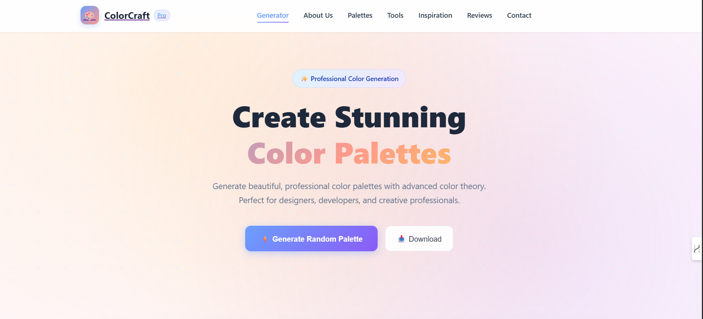
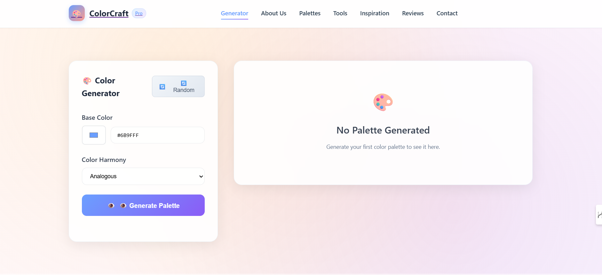
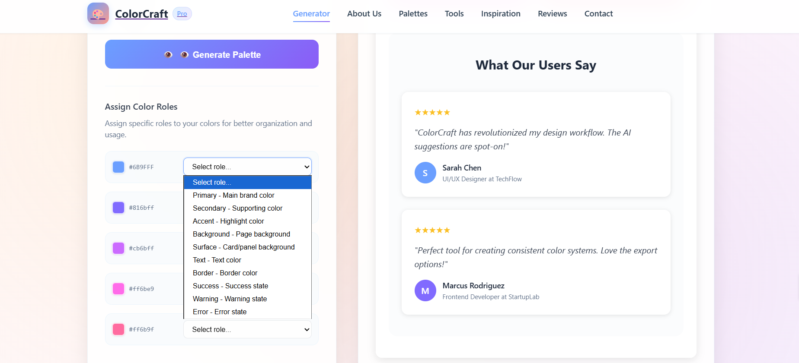

# 🎨 ColorCraft

A modern color palette generation platform built with **React** and **Firebase** that helps designers, developers, and creative professionals create beautiful and harmonious color combinations using proven color theory principles.

ColorCraft allows users to generate, explore, save, and manage professional color palettes using multiple color harmony techniques while providing inspiration galleries, authentication, and palette management features.

---

## 💡 Problem Statement

Designers and developers often struggle to create visually appealing color combinations quickly. ColorCraft solves this problem by generating professional color palettes based on established color theory principles, helping users build attractive and consistent designs efficiently.

---

## ✨ Features

### 🎨 Color Palette Generator

* Generate palettes from a selected base color
* Analogous Color Harmony
* Complementary Color Harmony
* Triadic Color Harmony
* Monochromatic Color Harmony
* Tetradic Color Harmony
* Split-Complementary Harmony
* Copy HEX color codes instantly
* Download palettes as JSON
* Assign semantic color roles

### 🖼️ Inspiration Gallery

* Browse trending color palettes
* Generate similar palettes
* Discover design inspirations
* Save favorite palettes

### 🛠️ Color Theory Tools

* Analogous Colors
* Complementary Colors
* Triadic Colors
* Monochromatic Colors
* Tetradic Colors
* Split Complementary Colors

### 📚 Palette Management

* Save palettes
* Delete palettes
* Export palettes
* Local storage persistence

### ⭐ User Reviews

* Submit reviews
* View user feedback
* Rating system

### 🔐 Authentication

* Firebase Authentication
* Email & Password Login
* User Registration
* Google Sign-In
* Session Management

### 📬 Contact Page

* Contact Form
* Feedback Submission
* Support Information

---

## 🛠️ Tech Stack

### Frontend

* React.js
* React Router DOM
* JavaScript (ES6+)
* CSS3

### Backend & Services

* Firebase Authentication
* Firebase Firestore
* Google OAuth

### Storage

* Browser LocalStorage

---

## 🛠️ Skills Demonstrated

* React Development
* Component-Based Architecture
* Firebase Authentication
* Firestore Database Integration
* React Router
* State Management
* Responsive UI Design
* Local Storage Management
* Color Theory Implementation
* API Integration

---

## 📸 Screenshots

### Home Page



### Palette Generator



### Features Page



### Color Role Assignment


## ⚙️ Installation

### Clone the Repository

```bash
git clone https://github.com/Gunjan934/ColorCraft.git
```

### Navigate to the Project Directory

```bash
cd ColorCraft
```

### Install Dependencies

```bash
npm install
```

### Run Development Server

```bash
npm run dev
```

---

## 📂 Project Structure

```text
src/
├── components/
├── pages/
├── App.jsx
├── App.css
├── main.jsx
└── data.json
```

---

## 🚀 Future Enhancements

* Dark Mode Support
* Gradient Generator
* Palette Sharing
* Accessibility Contrast Checker

---

## 👨‍💻 Author

**Gunjan**

GitHub: https://github.com/Gunjan934

---


### ⭐ If you found this project useful, consider giving it a star on GitHub! update to these screenshotes names 
